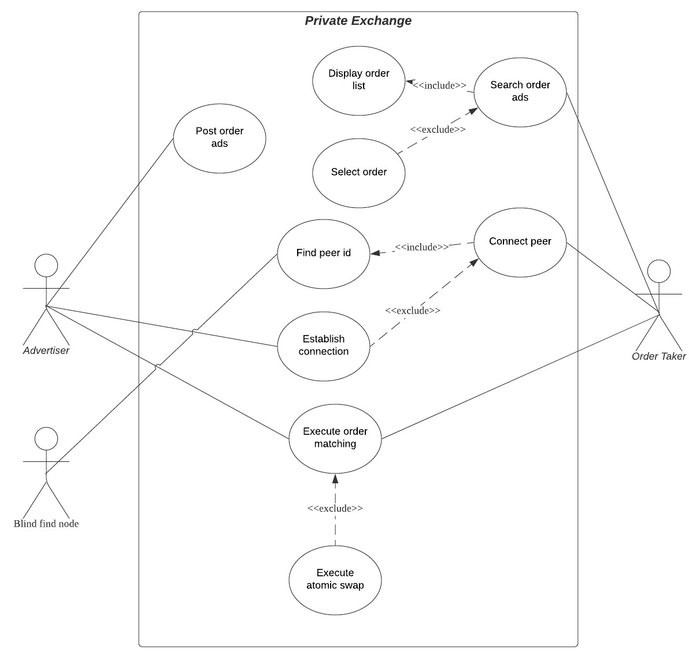

# Architecture

This document provides a architectural overview of **Private Exchange**. Explaining technology stack, usecases and system architecture.

## System architecture

## Technology stack

Private exchange consists of 3 main funtionalities. Order advertisement and private matching, peer finding and atomic swap. We use Peek a book, blind-find, SMP and ZKOPRU for each functionalities.

### Peek a book: Order advertisement and private order matching

We use peek a book protocol for order advertisement and private order matching.
Peek a book contract let order advertiser to post advertisement of exchange order with order pair and amount indicating which pair and how much amount the advertiser want to exchange. Advertisement consists of following fields `pair`, `sell_or_buy`, `amount` and `identity`.
Order take who wants to exchange the advertised pair can connect to the advertiser using `identity`. If connected, two parties execute private order matching protocol using SMP. In this protocol, the two parties only understand if their desired pair price matches or not. They won't learn any more than this fact. If the desired price matches, they proceed to atomic swap.

More info and implementation of peek-a-book and SMP can found here.

- [peek-a-book](https://github.com/mhchia/peek-a-book)
- [js-smp](https://github.com/mhchia/js-smp-peer)

### Blind-find: Peer finding

We use blind-find for private peer finding.

Order takers can search and connect to advertisers using blind-find network without revealing who they are searching for and finding out who has them as a peer. And the parties who were queried do not find out if the search was result was positive or negative and where the request came from, only that it came from one of their peers or was forwarded from one of their peers.

Detailed specs and implementation can be found here.
[blind-find](https://ethresear.ch/t/blind-find-private-social-network-search/6988)
[implementation](https://github.com/mhchia/blind-find/)

### ZKOPRU: Atomic swap

By utilizing zkopru atomic swap, two parties can swap their assets without revealing the content of the swap to anybody including zkopru coordinators.

Detailed explanation can be found here.
[zkopru atomic swap](https://docs.zkopru.network/how-it-works/atomic-swap)

## Use Cases diagram

Use cases of Private exchange system includes.

- Post order ads
- Search order ads
- Find/Connect peer
- Execute private order matching
- Execute atomic swap
- View History

Through these use cases, users can exchange their assets without revealing any information to others.

